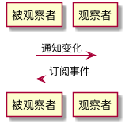
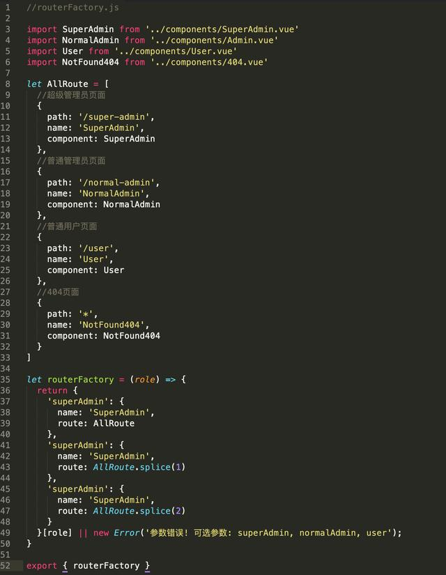
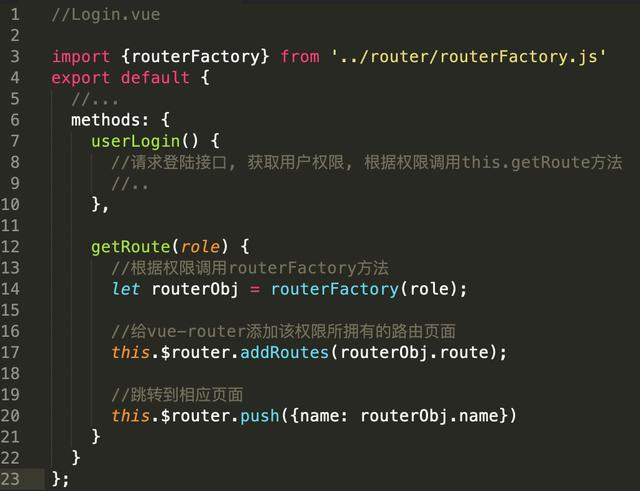

# 设计模式
虽然平时项目中或者框架源码中已经用过了一些设计模式，但前端对设计模式的讨论貌似还是不多。

## 观察者模式
观察者模式和发布-订阅模式之间的区别，在于是否存在第三方、发布者能否直接感知订阅者（如图所示）。


### 代码描述
```js
// 定义发布者类
class Publisher {
  constructor() {
    this.observers = []
    console.log('Publisher created')
  }
  // 增加订阅者
  add(observer) {
    console.log('Publisher.add invoked')
    this.observers.push(observer)
  }
  // 移除订阅者
  remove(observer) {
    console.log('Publisher.remove invoked')
    this.observers.forEach((item, i) => {
      if (item === observer) {
        this.observers.splice(i, 1)
      }
    })
  }
  // 通知所有订阅者
  notify() {
    console.log('Publisher.notify invoked')
    this.observers.forEach((observer) => {
      observer.update(this)
    })
  }
}
```

### 在项目中的应用
```js
class EventEmitter {
  constructor() {
    // handlers是一个map，用于存储事件与回调之间的对应关系
    this.handlers = {}
  }

  // on方法用于安装事件监听器，它接受目标事件名和回调函数作为参数
  on(eventName, cb) {
    // 先检查一下目标事件名有没有对应的监听函数队列
    if (!this.handlers[eventName]) {
      // 如果没有，那么首先初始化一个监听函数队列
      this.handlers[eventName] = []
    }

    // 把回调函数推入目标事件的监听函数队列里去
    this.handlers[eventName].push(cb)
  }

  // emit方法用于触发目标事件，它接受事件名和监听函数入参作为参数
  emit(eventName, ...args) {
    // 检查目标事件是否有监听函数队列
    if (this.handlers[eventName]) {
      // 如果有，则逐个调用队列里的回调函数
      this.handlers[eventName].forEach((callback) => {
        callback(...args)
      })
    }
  }

  // 移除某个事件回调队列里的指定回调函数
  off(eventName, cb) {
    const callbacks = this.handlers[eventName]
    const index = callbacks.indexOf(cb)
    if (index !== -1) {
      callbacks.splice(index, 1)
    }
  }

  // 为事件注册单次监听器
  once(eventName, cb) {
    // 对回调函数进行包装，使其执行完毕自动被移除
    const wrapper = (...args) => {
      cb.apply(...args)
      this.off(eventName, wrapper)
    }
    this.on(eventName, wrapper)
  }
}
```

## 工厂模式
简单层面的理解就是把写死的地方换成变量，通过传参共用函数。

### 代码描述
```js
function User(name , age, career, work) {
    this.name = name
    this.age = age
    this.career = career
    this.work = work
}

function Factory(name, age, career) {
    let work
    switch(career) {
        case 'coder':
            work =  ['写代码','写系分', '修Bug']
            break
        case 'product manager':
            work = ['订会议室', '写PRD', '催更']
            break
        case 'boss':
            work = ['喝茶', '看报', '见客户']
    }

    return new User(name, age, career, work)
}
```

### 在项目中的应用
比如在admin项目中，不同用户通常权限不同，如果每个页面路由都根据角色判断是否显示就非常冗余，而且低权限的用户如果知道高权限路由时，可以通过在浏览器上输入url跳转到高权限的页面（之前有项目由后端控制权限并返回对应有权限的页面，前端接收后再用函数对路由进行筛选）。此时，就可以根据用户角色统一控制哪些路由显示。


在登陆页导入该方法，请求登陆接口后根据权限添加路由:


## 单例模式
单例模式的核心是确保只有一个实例，并提供全局访问。比如弹窗只需要出现一个，又或者一个音乐播放程序，如果用户打开了一个音乐，又想打开一个音乐，那么之前的播放界面就会自动关闭，切换到当前的播放界面。

### 代码描述
```js
class SingleDog {
    show() {
        console.log('我是一个单例对象')
    }
    static getInstance() {
        // 判断是否已经new过1个实例
        if (!SingleDog.instance) {
            // 若这个唯一的实例不存在，那么先创建它
            SingleDog.instance = new SingleDog()
        }
        // 如果这个唯一的实例已经存在，则直接返回
        return SingleDog.instance
    }
}

const s1 = SingleDog.getInstance()
const s2 = SingleDog.getInstance()

// true
s1 === s2
```
```js
Singleton.getInstance = (function(){
  var instance = null;
  return function( name ){
    if ( !instance ){
      instance = new Singleton( name );
    }
    return instance;
  }
})();
```

### 在项目中的应用
vue.use通过单例模式避免重复安装插件。
```js
export function initUse (Vue: GlobalAPI) {
  Vue.use = function (plugin: Function | Object) {
    const installedPlugins = (this._installedPlugins || (this._installedPlugins = []))
    if (installedPlugins.indexOf(plugin) > -1) {
      return this
    }
    ......
  }
}
```
vuex在install时也会进行判断，避免因重复安装丢失状态。
```js
let Vue
export function install (_Vue) {
  // 判断传入的Vue实例对象是否已经被install过Vuex插件（是否有了唯一的state）
  if (Vue && _Vue === Vue) {
    if (process.env.NODE_ENV !== 'production') {
      console.error(
        '[vuex] already installed. Vue.use(Vuex) should be called only once.'
      )
    }
    return
  }
  // 若没有，则为这个Vue实例对象install一个唯一的Vuex
  Vue = _Vue
  // 将Vuex的初始化逻辑写进Vue的钩子函数里
  applyMixin(Vue)
}
```
## 装饰器模式
它的定义是“在不改变原对象的基础上，通过对其进行包装拓展，使原有对象可以满足用户的更复杂需求”。

### 代码描述
```js
const A = function(){console.log(1)}
const B = function(){console.log(2)}
const C = function(){console.log(3)}
var before = function( fn, beforefn ){
  return function(){
    beforefn(  );
    fn(  );
  }
}
var a = before(A,B)
a = before(a, C)
a()
// 3 2 1 //
```

### 在项目中的应用
高阶函数
```js
import React, { Component } from 'react'

const BorderHoc = WrappedComponent => class extends Component {
  render() {
    return <div style={{ border: 'solid 1px red' }}>
      <WrappedComponent />
    </div>
  }
}
export default borderHoc
```
redux的connect函数也是一个高阶函数
```js
export default function connect(mapStateToProps, mapDispatchToProps, mergeProps, options = {}) {
  return function wrapWithConnect(WrappedComponent) {
    class Connect extends Component {
      constructor(props, context) {
        // 从祖先Component处获得store
        this.store = props.store || context.store
        this.stateProps = computeStateProps(this.store, props)
        this.dispatchProps = computeDispatchProps(this.store, props)
        this.state = { storeState: null }
        // 对stateProps、dispatchProps、parentProps进行合并
        this.updateState()
      }
      shouldComponentUpdate(nextProps, nextState) {
        // 进行判断，当数据发生改变时，Component重新渲染
        if (propsChanged || mapStateProducedChange || dispatchPropsChanged) {
          this.updateState(nextProps)
          return true
        }
      }
      componentDidMount() {
        // 改变Component的state
        this.store.subscribe(() = {
          this.setState({
            storeState: this.store.getState()
          })
        })
      }
      render() {
        // 生成包裹组件Connect
        return (
          <WrappedComponent {...this.nextState} />
        )
      }
    }
    Connect.contextTypes = {
      store: storeShape
    }
    return Connect;
  }
}
```
es7装饰器写法
```js
// 把 connect 抽出来：
import { connect } from 'react-redux'
import { bindActionCreators } from 'redux'
import action from './action.js'

function mapStateToProps(state) {
  return state.app
}

function mapDispatchToProps(dispatch) {
  return bindActionCreators(action, dispatch)
}

// 将connect调用后的结果作为一个装饰器导出
export default connect(mapStateToProps, mapDispatchToProps)
```
```js
// 在组件里引入connect
import React, { Component } from 'react'
import connect from './connect.js'

@connect
export default class App extends Component {
  render() {
    // App的业务逻辑
  }
}
```

## 适配器模式
适配器模式的作用是解决两个软件实体间的接口不兼容的问题。使用适配器模式之后，原本
由于接口不兼容而不能工作的两个软件实体可以一起工作。

### 代码描述
```js
var googleMap = {
show: function(){
console.log( '开始渲染谷歌地图' );
}
};
var baiduMap = {
display: function(){
console.log( '开始渲染百度地图' );
}
};
var baiduMapAdapter = {
show: function(){
return baiduMap.display();
```
### 在项目中的应用
axios中使用适配器模式屏蔽平台差异
```js
function getDefaultAdapter() {
  var adapter;
  // Only Node.JS has a process variable that is of [[Class]] process
  if (typeof process !== 'undefined' && Object.prototype.toString.call(process) === '[object process]') {
    // For node use HTTP adapter
    adapter = require('./adapters/http');
  } else if (typeof XMLHttpRequest !== 'undefined') {
    // For browsers use XHR adapter
    adapter = require('./adapters/xhr');
  }
  return adapter;
}
```

## 代理模式
为了单一职责或者安全，自己能干的事让别人代办。。

### 在项目中的应用
图片预加载
```js
<!DOCTYPE html>
<html lang="en">
<head>
    <meta charset="UTF-8">
    <title>Document</title>
</head>
<body>

</body>
</html>
<script>

//立即执行函数
var myImg = (function(){
  //在页面上创建img元素
  var img = document.createElement("img");
  document.body.appendChild(img);
  return {
    setImg:function(src){
      img.src = src
    }
  }
})()

// 代理函数
var proxyImg = (function(){
  //如果给image加src属性后就相当于在浏览器中缓存了一张图片
  // Image()构造函数在功能上等同于document.createElement(‘img‘)。
  var image = new Image();
  // image有src并加载完成才会触发onload
  image.onload = function(){
    console.log("加载完毕")
    myImg.setImg(image.src);
  }
  return {
    setSrc:function(src){
      //loding
      myImg.setImg("1.png");
      //需要加载的图片
      image.src = src;
    }
  }
})()

//定义需要加载的图片路径
var src = "https://ss1.bdstatic.com/70cFvXSh_Q1YnxGkpoWK1HF6hhy/it/u=3127448566,3364301089&fm=26&gp=0.jpg";

// 调用函数
proxyImg.setSrc(src);
</script>
```
缓存代理
```js
var mult = function(){
console.log( '开始计算乘积' );
var a = 1;
for ( var i = 0, l = arguments.length; i < l; i++ ){
a = a * arguments[i];
}
return a;
};
mult( 2, 3 ); // 输出： 6
mult( 2, 3, 4 ); // 输出： 24
现在加入缓存代理函数：
var proxyMult = (function(){
var cache = {};
return function(){
var args = Array.prototype.join.call( arguments, ',' );
if ( args in cache ){
return cache[ args ];
}
return cache[ args ] = mult.apply( this, arguments );
}
})();
proxyMult( 1, 2, 3, 4 ); // 输出： 24
proxyMult( 1, 2, 3, 4 ); // 输出： 24
```

## 迭代器模式
迭代器模式提供一种方法顺序访问一个聚合对象中的各个元素，而又不暴露该对象的内部表示。

### 代码实现
es6版本
```js
// 编写一个迭代器生成函数
function *iteratorGenerator() {
  yield '1号选手'
  yield '2号选手'
  yield '3号选手'
}
const iterator = iteratorGenerator()
iterator.next()
iterator.next()
iterator.next()
```
es5版本
```js
// 定义生成器函数，入参是任意集合
function iteratorGenerator(list) {
  // idx记录当前访问的索引
  var idx = 0
  // len记录传入集合的长度
  var len = list.length
  return {
    // 自定义next方法
    next: function() {
      // 如果索引还没有超出集合长度，done为false
      var done = idx >= len
      // 如果done为false，则可以继续取值
      var value = !done ? list[idx++] : undefined
      // 将当前值与遍历是否完毕（done）返回
      return {
        done: done,
        value: value
      }
    }
  }
}
```

<!-- 参考资料：
https://juejin.im/book/5c70fc83518825428d7f9dfb/section/5c8bb9a3f265da2d8410cb7e
js设计模式与开发实践  曾探 -->
