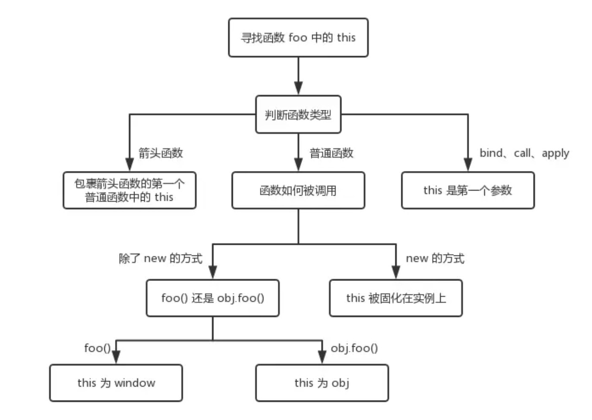
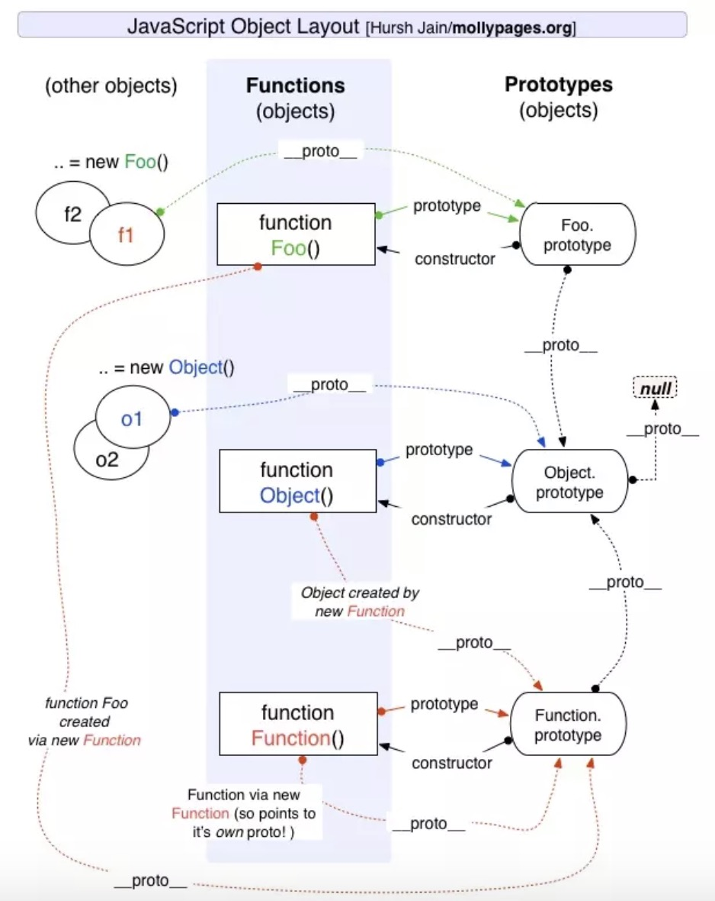

# 基础

## this
new 的方式优先级最高，接下来是 bind 这些函数，然后是 obj.foo() 这种调用方式，最后是 foo 这种调用方式，同时，箭头函数的 this 一旦被绑定，就不会再被任何方式所改变。


<!-- 关于this，你的不知道的js里讲的很清楚了
1. this的最终指向的是那个最近调用它的对象。
2. 有return时，如果返回值是一个对象，那么this指向的就是那个返回的对象，如果返回值不是一个对象那么this还是指向函数的实例。
3. 虽然null也是对象，但是在这里this还是指向那个函数的实例，因为null比较特殊。
4. new操作符会让this指向new出来的那个对象。
5. 四种绑定优先级及实现，例外（你不知道的js中有）
    由new调用？绑定到新创建的对象。
    由call或者apply（或者bind）调用？绑定到指定的对象。
    由上下文对象调用？绑定到那个上下文对象。
    默认：在严格模式下绑定到undefined，否则绑定到全局对象。

http://www.cnblogs.com/pssp/p/5216085.html -->

## 作用域及闭包
你的不知道的js里讲的很清楚了

如果查找的目的是对变量进行赋值，则进行LHS查询；如果查找的目的是获取变量的值，则进行RHS查询。

如果function是声明中的第一个词，就是函数声明，否则就是函数表达式。

let 和 const不进行提升，函数声明优于var变量声明提升。同名函数声明，后者生效，函数声明后的同名变量声明会被忽略。

闭包：内部函数可以访问外部函数作用域，并持有对原始词法作用域的引用。
js是词法作用域，所以函数只跟声明的位置有关。

模块的两个必要条件：1、要有一个外部嵌套函数。2、封闭函数必须返回至少一个内部函数。

<!-- http://www.jianshu.com/p/f91527492bf9
http://blog.csdn.net/qq_27582155/article/details/54340370
https://www.cnblogs.com/wind-lanyan/p/6552835.html -->


## call,apply,bind
如果要传递的参数不多，则可以使用fn.call(thisObj, arg1, arg2 ...)

如果要传递的参数很多，则可以用数组将参数整理好调用fn.apply(thisObj, [arg1, arg2 ...])

如果想生成一个新的函数长期绑定某个函数给某个对象使用，则可以使用const newFn = fn.bind(thisObj); newFn(arg1, arg2...)

## let和const

### 块级作用域

内层作用域可以定义外层作用域的同名变量。
```js
{{{{
  let insane = 'Hello World';
  {let insane = 'Hello World'}
}}}};
```
块级作用域的出现，实际上使得获得广泛应用的立即执行函数表达式（IIFE）不再必要了。

const实际上保证的，并不是变量的值不得改动，而是变量指向的那个内存地址所保存的数据不得改动。如果真的想将对象冻结，应该使用Object.freeze方法。
```js
const foo = Object.freeze({});

// 常规模式时，下面一行不起作用；
// 严格模式时，该行会报错
foo.prop = 123;
```
### 变量提升
var申明的变量会被提升，挂到顶层对象。

函数提升优先于变量提升，函数提升会把整个函数挪到作用域顶部，变量提升只会把声明挪到作用域顶部。

ES6 为了改变这一点，一方面规定，为了保持兼容性，var命令和function命令声明的全局变量，依旧是顶层对象的属性；另一方面规定，let命令、const命令、class命令声明的全局变量，不属于顶层对象的属性。也就是说，从 ES6 开始，全局变量将逐步与顶层对象的属性脱钩。
```js
var a = 1;
// 如果在 Node 的 REPL 环境，可以写成 global.a
// 或者采用通用方法，写成 this.a
window.a // 1

let b = 1;
window.b // undefined
```
上面代码中，全局变量a由var命令声明，所以它是顶层对象的属性；全局变量b由let命令声明，所以它不是顶层对象的属性，返回undefined。

### 暂时性死区
```js
var tmp = 123;

if (true) {
  tmp = 'abc'; // ReferenceError
  let tmp;
}
上面代码中，存在全局变量tmp，但是块级作用域内let又声明了一个局部变量tmp，导致后者绑定这个块级作用域，所以在let声明变量前，对tmp赋值会报错。
```
有些“死区”比较隐蔽，不太容易发现。
```js
function bar(x = y, y = 2) {
  return [x, y];
}

bar(); // 报错
```
ES6 规定暂时性死区和let、const语句不出现变量提升，主要是为了减少运行时错误，防止在变量声明前就使用这个变量，从而导致意料之外的行为。这样的错误在 ES5 是很常见的，现在有了这种规定，避免此类错误就很容易了。

## 解构赋值
对于 Set 结构，也可以使用数组的解构赋值。

let [x, y, z] = new Set(['a', 'b', 'c']);
x // "a"
事实上，只要某种数据结构具有 Iterator 接口，都可以采用数组形式的解构赋值。

function* fibs() {
  let a = 0;
  let b = 1;
  while (true) {
    yield a;
    [a, b] = [b, a + b];
  }
}

let [first, second, third, fourth, fifth, sixth] = fibs();
sixth // 5
上面代码中，fibs是一个 Generator 函数（参见《Generator 函数》一章），原生具有 Iterator 接口。解构赋值会依次从这个接口获取值。
对象的解构赋值是下面形式的简写（参见《对象的扩展》一章）。

let { foo: foo, bar: bar } = { foo: "aaa", bar: "bbb" };
也就是说，对象的解构赋值的内部机制，是先找到同名属性，然后再赋给对应的变量。真正被赋值的是后者，而不是前者。

let { foo: baz } = { foo: "aaa", bar: "bbb" };
baz // "aaa"
foo // error: foo is not defined
上面代码中，foo是匹配的模式，baz才是变量。真正被赋值的是变量baz，而不是模式foo。


默认值生效的条件是，对象的属性值严格等于undefined。

var {x = 3} = {x: undefined};
x // 3

var {x = 3} = {x: null};
x // null

如果解构失败，变量的值等于undefined。


## 字符串扩展
ES6 又提供了三种新方法。

includes()：返回布尔值，表示是否找到了参数字符串。
startsWith()：返回布尔值，表示参数字符串是否在原字符串的头部。
endsWith()：返回布尔值，表示参数字符串是否在原字符串的尾部。

repeat方法返回一个新字符串，表示将原字符串重复n次。

ES2017 引入了字符串补全长度的功能。如果某个字符串不够指定长度，会在头部或尾部补全。padStart()用于头部补全，padEnd()用于尾部补全。

模板字符串甚至还能嵌套。

## 正则扩展

字符串对象共有 4 个方法，可以使用正则表达式：match()、replace()、search()和split()。

ES6 将这 4 个方法，在语言内部全部调用RegExp的实例方法，从而做到所有与正则相关的方法，全都定义在RegExp对象上。

## 数组扩展

Math.trunc方法用于去除一个数的小数部分，返回整数部分。
对于没有部署这个方法的环境，可以用下面的代码模拟。
```js
Math.trunc = Math.trunc || function(x) {
  return x < 0 ? Math.ceil(x) : Math.floor(x);
};
```

Math.sign方法用来判断一个数到底是正数、负数、还是零。
对于没有部署这个方法的环境，可以用下面的代码模拟。
```js
Math.sign = Math.sign || function(x) {
  x = +x; // convert to a number
  if (x === 0 || isNaN(x)) {
    return x;
  }
  return x > 0 ? 1 : -1;
};
```
import xx from '/aa'
import{xx}from '/aa'
区别就是第一个是通过export default导出的，第二个是export导出的。

## 函数扩展

箭头函数有几个使用注意点。

（1）函数体内的this对象，就是定义时所在的对象，而不是使用时所在的对象。

（2）不可以当作构造函数，也就是说，不可以使用new命令，否则会抛出一个错误。

（3）不可以使用arguments对象，该对象在函数体内不存在。如果要用，可以用 rest 参数代替。

（4）不可以使用yield命令，因此箭头函数不能用作 Generator 函数。
 ```js
 function foo() {
  setTimeout(() => {
    console.log('id:', this.id);
  }, 100);
}

var id = 21;

foo.call({ id: 42 });
// id: 42
```
 ```js
function Timer() {
  this.s1 = 0;
  this.s2 = 0;
  // 箭头函数
  setInterval(() => this.s1++, 1000);
  // 普通函数
  setInterval(function () {
    this.s2++;
  }, 1000);
}

var timer = new Timer();

setTimeout(() => console.log('s1: ', timer.s1), 3100);
setTimeout(() => console.log('s2: ', timer.s2), 3100);
// s1: 3
// s2: 0
```
上面代码中，Timer函数内部设置了两个定时器，分别使用了箭头函数和普通函数。前者的this绑定定义时所在的作用域（即Timer函数），后者的this指向运行时所在的作用域（即全局对象）。所以，3100 毫秒之后，timer.s1被更新了 3 次，而timer.s2一次都没更新。

this指向的固定化，并不是因为箭头函数内部有绑定this的机制，实际原因是箭头函数根本没有自己的this，导致内部的this就是外层代码块的this。正是因为它没有this，所以也就不能用作构造函数。
```js
// ES6
function foo() {
  setTimeout(() => {
    console.log('id:', this.id);
  }, 100);
}

// ES5
function foo() {
  var _this = this;

  setTimeout(function () {
    console.log('id:', _this.id);
  }, 100);
}
```
上面代码中，转换后的 ES5 版本清楚地说明了，箭头函数里面根本没有自己的this，而是引用外层的this。

### 尾调用优化
尾调用（Tail Call）是函数式编程的一个重要概念，本身非常简单，一句话就能说清楚，就是指某个函数的最后一步是调用另一个函数。
尾调用不一定出现在函数尾部，只要是最后一步操作即可。
```js
function f(x) {
  if (x > 0) {
    return m(x)
  }
  return n(x);
}
```
上面代码中，函数m和n都属于尾调用，因为它们都是函数f的最后一步操作。

函数调用会在内存形成一个“调用记录”，又称“调用帧”（call frame），保存调用位置和内部变量等信息。如果在函数A的内部调用函数B，那么在A的调用帧上方，还会形成一个B的调用帧。等到B运行结束，将结果返回到A，B的调用帧才会消失。如果函数B内部还调用函数C，那就还有一个C的调用帧，以此类推。所有的调用帧，就形成一个“调用栈”（call stack）。

尾调用由于是函数的最后一步操作，所以不需要保留外层函数的调用帧，因为调用位置、内部变量等信息都不会再用到了，只要直接用内层函数的调用帧，取代外层函数的调用帧就可以了。
```js
function f() {
  let m = 1;
  let n = 2;
  return g(m + n);
}
f();

// 等同于
function f() {
  return g(3);
}
f();

// 等同于
g(3)
```
上面代码中，如果函数g不是尾调用，函数f就需要保存内部变量m和n的值、g的调用位置等信息。但由于调用g之后，函数f就结束了，所以执行到最后一步，完全可以删除f(x)的调用帧，只保留g(3)的调用帧。

这就叫做“尾调用优化”（Tail call optimization），即只保留内层函数的调用帧。如果所有函数都是尾调用，那么完全可以做到每次执行时，调用帧只有一项，这将大大节省内存。这就是“尾调用优化”的意义。

注意，只有不再用到外层函数的内部变量，内层函数的调用帧才会取代外层函数的调用帧，否则就无法进行“尾调用优化”。
```js
function addOne(a){
  var one = 1;
  function inner(b){
    return b + one;
  }
  return inner(a);
}
```
上面的函数不会进行尾调用优化，因为内层函数inner用到了外层函数addOne的内部变量one。

### 尾递归
函数调用自身，称为递归。如果尾调用自身，就称为尾递归。

递归非常耗费内存，因为需要同时保存成千上百个调用帧，很容易发生“栈溢出”错误（stack overflow）。但对于尾递归来说，由于只存在一个调用帧，所以永远不会发生“栈溢出”错误。

## 对象的扩展

### Object.is()
ES5 比较两个值是否相等，只有两个运算符：相等运算符（==）和严格相等运算符（===）。它们都有缺点，前者会自动转换数据类型，后者的NaN不等于自身，以及+0等于-0。
Object.is与===不同之处只有两个：一是+0不等于-0，二是NaN等于自身。
```js
+0 === -0 //true
NaN === NaN // false

Object.is(+0, -0) // false
Object.is(NaN, NaN) // true
ES5 可以通过下面的代码，部署Object.is。

Object.defineProperty(Object, 'is', {
  value: function(x, y) {
    if (x === y) {
      // 针对+0 不等于 -0的情况
      return x !== 0 || 1 / x === 1 / y;
    }
    // 针对NaN的情况
    return x !== x && y !== y;
  },
  configurable: true,
  enumerable: false,
  writable: true
});
```
### Object.assign
除了字符串会以数组形式，拷贝入目标对象，其他值都不会产生效果。

布尔值、数值、字符串分别转成对应的包装对象，可以看到它们的原始值都在包装对象的内部属性[[PrimitiveValue]]上面，这个属性是不会被Object.assign拷贝的。只有字符串的包装对象，会产生可枚举的实义属性，那些属性则会被拷贝。

Object.assign拷贝的属性是有限制的，只拷贝源对象的自身属性（不拷贝继承属性），也不拷贝不可枚举的属性（enumerable: false）。
数组的处理

Object.assign可以用来处理数组，但是会把数组视为对象。
```js
Object.assign([1, 2, 3], [4, 5])
// [4, 5, 3]
```
上面代码中，Object.assign把数组视为属性名为 0、1、2 的对象，因此源数组的 0 号属性4覆盖了目标数组的 0 号属性1。

### 可枚举性
目前，有四个操作会忽略enumerable为false的属性。

for...in循环：只遍历对象自身的和继承的可枚举的属性。
Object.keys()：返回对象自身的所有可枚举的属性的键名。
JSON.stringify()：只串行化对象自身的可枚举的属性。
Object.assign()： 忽略enumerable为false的属性，只拷贝对象自身的可枚举的属性。

### Object.keys()，Object.values()，Object.entries()

ES5 引入了Object.keys方法，返回一个数组，成员是参数对象自身的（不含继承的）所有可遍历（enumerable）属性的键名。

S2017 引入了跟Object.keys配套的Object.values和Object.entries，作为遍历一个对象的补充手段，供for...of循环使用。

Object.values方法返回一个数组，成员是参数对象自身的（不含继承的）所有可遍历（enumerable）属性的键值。

Object.entries方法返回一个数组，成员是参数对象自身的（不含继承的）所有可遍历（enumerable）属性的键值对数组。
Object.entries的基本用途是遍历对象的属性。
```js
let obj = { one: 1, two: 2 };
for (let [k, v] of Object.entries(obj)) {
  console.log(
    `${JSON.stringify(k)}: ${JSON.stringify(v)}`
  );
}
// "one": 1
// "two": 2
Object.entries方法的另一个用处是，将对象转为真正的Map结构。

const obj = { foo: 'bar', baz: 42 };
const map = new Map(Object.entries(obj));
map // Map { foo: "bar", baz: 42 }
```
自己实现Object.entries方法，非常简单。
```js
// Generator函数的版本
function* entries(obj) {
  for (let key of Object.keys(obj)) {
    yield [key, obj[key]];
  }
}

// 非Generator函数的版本
function entries(obj) {
  let arr = [];
  for (let key of Object.keys(obj)) {
    arr.push([key, obj[key]]);
  }
  return arr;
}
```
### 扩展运算符
对象的扩展运算符（...）用于取出参数对象的所有可遍历属性，拷贝到当前对象之中。
```js
let z = { a: 3, b: 4 };
let n = { ...z };
n // { a: 3, b: 4 }
这等同于使用Object.assign方法。

let aClone = { ...a };
// 等同于
let aClone = Object.assign({}, a);
上面的例子只是拷贝了对象实例的属性，如果想完整克隆一个对象，还拷贝对象原型的属性，可以采用下面的写法。

// 写法一
const clone1 = {
  __proto__: Object.getPrototypeOf(obj),
  ...obj
};

// 写法二
const clone2 = Object.assign(
  Object.create(Object.getPrototypeOf(obj)),
  obj
);

// 写法三
const clone3 = Object.create(
  Object.getPrototypeOf(obj),
  Object.getOwnPropertyDescriptors(obj)
)
```

## Set 和 Map
ES6 提供了新的数据结构 Set。它类似于数组，但是成员的值都是唯一的，没有重复的值。

Set 本身是一个构造函数，用来生成 Set 数据结构。

Set 函数可以接受一个数组（或者具有 iterable 接口的其他数据结构）作为参数，用来初始化。

一种去除数组重复成员的方法。
```js
// 去除数组的重复成员
[...new Set(array)]
```
向 Set 加入值的时候，不会发生类型转换，所以5和"5"是两个不同的值。Set 内部判断两个值是否不同，使用的算法叫做“Same-value-zero equality”，它类似于精确相等运算符（===），主要的区别是NaN等于自身，而精确相等运算符认为NaN不等于自身。

Set 实例的方法分为两大类：操作方法（用于操作数据）和遍历方法（用于遍历成员）。下面先介绍四个操作方法。

add(value)：添加某个值，返回 Set 结构本身。
delete(value)：删除某个值，返回一个布尔值，表示删除是否成功。
has(value)：返回一个布尔值，表示该值是否为Set的成员。
clear()：清除所有成员，没有返回值。
上面这些属性和方法的实例如下。
```js
s.add(1).add(2).add(2);
// 注意2被加入了两次

s.size // 2

s.has(1) // true
s.has(2) // true
s.has(3) // false

s.delete(2);
s.has(2) // false
```
Array.from方法可以将 Set 结构转为数组。
```js
const items = new Set([1, 2, 3, 4, 5]);
const array = Array.from(items);
```
这就提供了去除数组重复成员的另一种方法。

Set 结构的实例有四个遍历方法，可以用于遍历成员。

keys()：返回键名的遍历器
values()：返回键值的遍历器
entries()：返回键值对的遍历器
forEach()：使用回调函数遍历每个成员
需要特别指出的是，Set的遍历顺序就是插入顺序。这个特性有时非常有用，比如使用 Set 保存一个回调函数列表，调用时就能保证按照添加顺序调用。

使用 Set 可以很容易地实现并集（Union）、交集（Intersect）和差集（Difference）。
```js
let a = new Set([1, 2, 3]);
let b = new Set([4, 3, 2]);

// 并集
let union = new Set([...a, ...b]);
// Set {1, 2, 3, 4}

// 交集
let intersect = new Set([...a].filter(x => b.has(x)));
// set {2, 3}

// 差集
let difference = new Set([...a].filter(x => !b.has(x)));
// Set {1}
```
### WeakSet
WeakSet 结构与 Set 类似，也是不重复的值的集合。但是，它与 Set 有两个区别。

首先，WeakSet 的成员只能是对象，而不能是其他类型的值。
```js
const a = [[1, 2], [3, 4]];
const ws = new WeakSet(a);
// WeakSet {[1, 2], [3, 4]}
```
注意，是a数组的成员成为 WeakSet 的成员，而不是a数组本身。这意味着，数组的成员只能是对象。

WeakSet 结构有以下三个方法。

WeakSet.prototype.add(value)：向 WeakSet 实例添加一个新成员。
WeakSet.prototype.delete(value)：清除 WeakSet 实例的指定成员。
WeakSet.prototype.has(value)：返回一个布尔值，表示某个值是否在 WeakSet 实例之中。

### Map
Object 结构提供了“字符串—值”的对应，Map 结构提供了“值—值”的对应，是一种更完善的 Hash 结构实现。
Map构造函数接受数组作为参数，实际上执行的是下面的算法。
```js
const items = [
  ['name', '张三'],
  ['title', 'Author']
];

const map = new Map();

items.forEach(
  ([key, value]) => map.set(key, value)
);
```
事实上，不仅仅是数组，任何具有 Iterator 接口、且每个成员都是一个双元素的数组的数据结构（详见《Iterator》一章）都可以当作Map构造函数的参数。这就是说，Set和Map都可以用来生成新的 Map。
```js
const set = new Set([
  ['foo', 1],
  ['bar', 2]
]);
const m1 = new Map(set);
m1.get('foo') // 1

const m2 = new Map([['baz', 3]]);
const m3 = new Map(m2);
m3.get('baz') // 3
```
Map 结构原生提供三个遍历器生成函数和一个遍历方法。

keys()：返回键名的遍历器。
values()：返回键值的遍历器。
entries()：返回所有成员的遍历器。
forEach()：遍历 Map 的所有成员。
需要特别注意的是，Map 的遍历顺序就是插入顺序。

Map 结构转为数组结构，比较快速的方法是使用扩展运算符（...）。

```js
const map = new Map([
  [1, 'one'],
  [2, 'two'],
  [3, 'three'],
]);

[...map.keys()]
// [1, 2, 3]

[...map.values()]
// ['one', 'two', 'three']

[...map.entries()]
// [[1,'one'], [2, 'two'], [3, 'three']]

[...map]
// [[1,'one'], [2, 'two'], [3, 'three']]
```
结合数组的map方法、filter方法，可以实现 Map 的遍历和过滤（Map 本身没有map和filter方法）。
```js
const map0 = new Map()
  .set(1, 'a')
  .set(2, 'b')
  .set(3, 'c');

const map1 = new Map(
  [...map0].filter(([k, v]) => k < 3)
);
// 产生 Map 结构 {1 => 'a', 2 => 'b'}

const map2 = new Map(
  [...map0].map(([k, v]) => [k * 2, '_' + v])
    );
// 产生 Map 结构 {2 => '_a', 4 => '_b', 6 => '_c'}
```

#### 互相转
（1）Map 转为数组

前面已经提过，Map 转为数组最方便的方法，就是使用扩展运算符（...）。
```js
const myMap = new Map()
  .set(true, 7)
  .set({foo: 3}, ['abc']);
[...myMap]
// [ [ true, 7 ], [ { foo: 3 }, [ 'abc' ] ] ]
```
（2）数组 转为 Map

将数组传入 Map 构造函数，就可以转为 Map。
```js
new Map([
  [true, 7],
  [{foo: 3}, ['abc']]
])
// Map {
//   true => 7,
//   Object {foo: 3} => ['abc']
// }
```
（3）Map 转为对象

如果所有 Map 的键都是字符串，它可以无损地转为对象。
```js
function strMapToObj(strMap) {
  let obj = Object.create(null);
  for (let [k,v] of strMap) {
    obj[k] = v;
  }
  return obj;
}

const myMap = new Map()
  .set('yes', true)
  .set('no', false);
strMapToObj(myMap)
// { yes: true, no: false }
```
如果有非字符串的键名，那么这个键名会被转成字符串，再作为对象的键名。

（4）对象转为 Map
```js
function objToStrMap(obj) {
  let strMap = new Map();
  for (let k of Object.keys(obj)) {
    strMap.set(k, obj[k]);
  }
  return strMap;
}

objToStrMap({yes: true, no: false})
// Map {"yes" => true, "no" => false}
```
（5）Map 转为 JSON

Map 转为 JSON 要区分两种情况。一种情况是，Map 的键名都是字符串，这时可以选择转为对象 JSON。
```js
function strMapToJson(strMap) {
  return JSON.stringify(strMapToObj(strMap));
}

let myMap = new Map().set('yes', true).set('no', false);
strMapToJson(myMap)
// '{"yes":true,"no":false}'
```
另一种情况是，Map 的键名有非字符串，这时可以选择转为数组 JSON。
```js
function mapToArrayJson(map) {
  return JSON.stringify([...map]);
}

let myMap = new Map().set(true, 7).set({foo: 3}, ['abc']);
mapToArrayJson(myMap)
// '[[true,7],[{"foo":3},["abc"]]]'
```
（6）JSON 转为 Map

JSON 转为 Map，正常情况下，所有键名都是字符串。
```js
function jsonToStrMap(jsonStr) {
  return objToStrMap(JSON.parse(jsonStr));
}

jsonToStrMap('{"yes": true, "no": false}')
// Map {'yes' => true, 'no' => false}
```
但是，有一种特殊情况，整个 JSON 就是一个数组，且每个数组成员本身，又是一个有两个成员的数组。这时，它可以一一对应地转为 Map。这往往是 Map 转为数组 JSON 的逆操作。
```js
function jsonToMap(jsonStr) {
  return new Map(JSON.parse(jsonStr));
}

jsonToMap('[[true,7],[{"foo":3},["abc"]]]')
// Map {true => 7, Object {foo: 3} => ['abc']}
```

### WeakMap
WeakMap与Map的区别有两点。

首先，WeakMap只接受对象作为键名（null除外），不接受其他类型的值作为键名。
其次，WeakMap的键名所指向的对象，不计入垃圾回收机制。

WeakMap的设计目的在于，有时我们想在某个对象上面存放一些数据，但是这会形成对于这个对象的引用。请看下面的例子。

基本上，如果要往对象上添加数据，又不想干扰垃圾回收机制，就可以使用 WeakMap。一个典型应用场景是，在网页的 DOM 元素上添加数据，就可以使用WeakMap结构。当该 DOM 元素被清除，其所对应的WeakMap记录就会自动被移除。

WeakMap 与 Map 在 API 上的区别主要是两个，一是没有遍历操作（即没有keys()、values()和entries()方法），也没有size属性。因为没有办法列出所有键名，某个键名是否存在完全不可预测，跟垃圾回收机制是否运行相关。这一刻可以取到键名，下一刻垃圾回收机制突然运行了，这个键名就没了，为了防止出现不确定性，就统一规定不能取到键名。二是无法清空，即不支持clear方法。因此，WeakMap只有四个方法可用：get()、set()、has()、delete()。

WeakMap 的另一个用处是部署私有属性。

## 原型
原型本身不难懂，但__proto__和prototype比较容易混淆。
prototype是构造函数的一个属性，指向构造函数的原型。原型上的constructor又指回构造函数。
__proto__是对象的一个属性，指向它的原型。__proto__ 将对象和原型连接起来组成了原型链。

